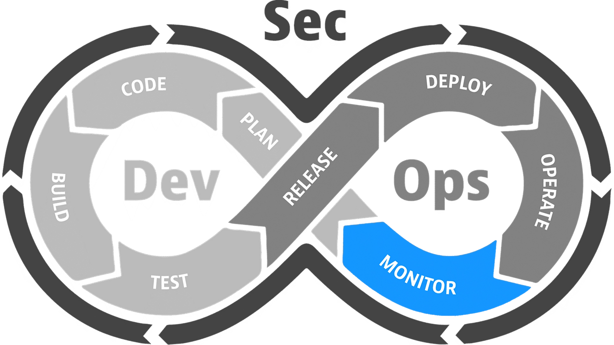

# devsecops-monitor
The Monitor phase is critical in DevSecOps, focusing on ensuring the software remains secure, reliable, and compliant in a live environment.



## 🛠️ Technology Stack
- **Prometheus**: An open-source systems monitoring and alerting toolkit used to collect and store metrics.
- **Grafana**: An open-source platform for monitoring and observability, used to visualize metrics and create dashboards.
- **Blackbox Exporter**: A Prometheus exporter for probing endpoints such as HTTP, HTTPS, DNS, TCP, ICMP, and gRPC.

## 🛠️ Installation

To install and set up the project, follow these steps:

1. Clone the repository:

    ```sh
    git clone https://github.com/wendelsilverio/devsecops-monitor.git
    cd devsecops-monitor
    ```

2. Install Docker by following the instructions [here](https://docs.docker.com/get-docker/).

3. Set up the development environment with Docker:

    ```sh
    docker-compose up
    ```

## 📅 Activity List

### Define Monitoring Requirements
- [ ] Identify key performance indicators (KPIs) and metrics to be monitored.
- [ ] Determine data collection frequency and necessary alerts.

### Set Up Monitoring Environment
- [X] Create a `docker-compose.yml` file to configure monitoring services.
- [X] Configure Prometheus to collect metrics.
- [X] Configure Blackbox Exporter to monitor URL availability.
- [X] Configure Grafana to visualize collected metrics.

## 🤝 Contributing

We welcome contributions from the community. Please read our [CONTRIBUTING.md](CONTRIBUTING.md) for guidelines on how to contribute.

## 📄 License

This project is licensed under the MIT License. See the [LICENSE](LICENSE) file for details.